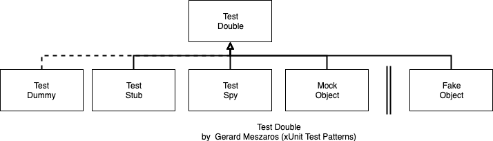

= Spring Functional Bean and Configuration Sandbox

*Features*

* Spring Boot
* Spring Functional Bean Definition Dsl
* Spring KoFu (no component-scan)
* Spring container and component testing
* Multiple test sets
* Multiple gradle projects
* Gradle Kotlin Dsl

The project imagines you want to produce pizza. For that you need a *catalogue* of all possible ingredients and a *factory* with an inventory that can make pizzas.

The structure follows the ideas from the link:http://c4model.com/[C4 Model].

* Components are collections of classes, that have the same overall purpose. For example catalogue or factory.
* Containers are things that are running, spring containers in our case. They can contain one or more components. In this project they are named after italian cities, naturally.

== Usage

* Build complete project `./gradlew build`
* Run individual project `./gradlew :container:rome:bootRun`
* Test only medium tests `./gradlew mediumTest`
* List available tasks `./gradlew tasks`

== Gradle

The link:https://gradle.org/[Gradle] build tool is an alternative to link:https://maven.apache.org/[Maven]. It's built system consists of two major building blocks

1. project
2. task

A Gradle build system is made up of one or more projects and each project contains one or more tasks. A project represents an artifact that needs to be built.

Gradle has a simple link:https://docs.gradle.org/current/userguide/command_line_interface.html[command-line interface].

* View all projects `./gradlew projects`
* View the available tasks `./gradlew tasks`

=== Wrapper

Please make sure you have the newest Gradle (>= v6) version installed if you run the `gradle wrapper` task.

=== BuildSrc

BuildSrc is a project in the root of your build. Everything written there will be shared by all your build scripts. We can use buildSrc to write our own gradle tasks, plugins or extensions functions that will be available in all `build.gradle.kts`. The gradle team also recommends placing dependency versions there.

BuildSrc Plugins can be applied the same way as regular plugins. We can specify an id alias by placing a properties file in `buildSrc/src/main/resources/META-INF.gradle-plugins`.

=== Test

Specifying test and test options is relatively straightforward using gradle. The link:https://docs.gradle.org/current/userguide/java_testing.html[JavaTesting Guide] and the official docs for the link:https://docs.gradle.org/current/dsl/org.gradle.api.tasks.testing.Test.html[Test Api] provide a good starting point. They also help when it comes to defining a more complicated test setup using multiple testsets.

In our case we wrote a custom buildSrc plugin to define multiple testsets that can share code between them. We could have also used the link:https://github.com/unbroken-dome/gradle-testsets-plugin[Gradle TestSets plugin], an example code base can be found link:https://github.com/Richargh/testsets-plugin-krdl-kt-sandbox[here].

=== Gradle Kotlin Dsl

* You can find lots of official link:https://github.com/gradle/kotlin-dsl-samples/tree/master/samples[Gradle Kotlin Dsl Samples] online
* The official docs provide a link:https://guides.gradle.org/migrating-build-logic-from-groovy-to-kotlin/[Migration Guide] from Groovy to Kotlin
* There is also the link:https://docs.gradle.org/current/userguide/kotlin_dsl.html[Gradle Kotlin DSL User Guide] to consider.

=== Dependencies

// TODO

"api"
"implementation"
"testImplementation"

=== Plugins

Plugins can modify your build quite a lot. For example they can add tasks or new extensions to a project. They are usually added in the `plugins {}` block of a `build.gradle.kts`. The normal way is to supply an `id("...")`.

If you want an executable jar, you would usually add the application plugin `plugins { id("org.gradle.application") }`. Gradle provides aliases for the common plugin they supply. So `id("org.gradle.application")` becomes `\`application\``. JetBrains provides a different alias for all the kotlin plugins and `id("org.jetbrains.kotlin.jvm")` becomes `kotlin("jvm")`.

The link:https://docs.gradle.org/current/userguide/kotlin_dsl.html#sec:multi_project_builds_applying_plugins[Gradle Kotlin Dsl convention] is to declare plugins and their version in the root project build script without applying them. The subprojects can then apply the plugins on demand but should not specify the version.

=== Scripts

You can create a buildSrc plugin if your `build.gradle.kts` becomes to big. Depending on your use case you can also split your `.kts` into multiple ones and reapply the script with `apply(from = "script-plugin.gradle.kts")`.

== Spring

=== Spring Kotlin Bean DSL

The Spring Kotlin Bean DSL was introduced with Spring 5. An excellent resource if you want to migrate from component scan to the new dsl is link:https://blog.frankel.ch/spring-boot-migrating-functional/[Spring Boot, migrating to functional].

=== Spring Router DSL

link:https://docs.spring.io/spring/docs/current/spring-framework-reference/languages.html#router-dsl[Spring Router DSL].

=== Configuring Spring

link:https://spring.io/blog/2019/01/21/manual-bean-definitions-in-spring-boot[Manual AutoConfiguration Defintions] are a thing in Spring.

==== Spring Fu

link:https://github.com/rodolphocouto/spring-fu-sample/[other sample].

=== Spring Testing

link:https://docs.spring.io/spring-boot/docs/current/reference/html/appendix-test-auto-configuration.html[Test Auto-configuration Annotations].

=== Kotlin Script Templates

link:https://github.com/sdeleuze/kotlin-script-templating[sample project] and link:https://docs.spring.io/spring/docs/current/spring-framework-reference/languages.html#kotlin-script-templates[reference docs].

== Testing

Testing is a divisive topic. "What is an unit test", "what is an integration test", "how many tests per category do we need" and "how much coverage should they have" are regular questions in most teams and clear answers are hard to agree on. This project suggests one possible answer with multiple testsets that each contain multiple types of tests. The answer works under the assumption that we want feedback as fast as possible, especially for the business logic, and that we want to support refactoring as much as possible.

=== Integration Test does not mean anything

link:https://reflectoring.io/spring-boot-test/#integration-tests-vs-unit-tests[Reflectoring.io writes] that an integration test can a) cover multiple "units", b) cover multiple layers, or c) test multiple paths through the application.

Running the test from different category (a) might take a couple of milliseconds, b) hundreds of milliseconds and c) might even take seconds. In addition to test execution time the purpose of these three categories is also very different. Hence it is not very helpful to describe something as an integration test. We need a better definition to write better tests as a team. Thankfully there is a lot of good material out there which we can build a definition on top of.

=== Unit Test

Unlike integration tests, unit tests do have a definition:

[quote, Michael Feathers, 'Defined in link:https://www.artima.com/weblogs/viewpost.jsp?thread=126923[A Set of Unit Testing Rules]']
____
A test is not a unit test if:

* It talks to the database
* It communicates across the network
* It touches the file system
* It can't run at the same time as any of your other unit tests
* You have to do special things to your environment (such as editing config files) to run it.

Tests that do these things aren't bad. Often they are worth writing, and they can be written in a unit test harness. However, it is important to be able to separate them from true unit tests so that we can keep a set of tests that we can run fast whenever we make our changes.
____
{empty} +

The idea is really to have fast developer tests that we can run at any time to ensure we have not broken something essential. They should complete in seconds for each component. If we run the tests and are able to get a cup of coffee, they are too slow. For that to work each individual test needs to complete in a couple of milliseconds.

In object-oriented languages it is sadly common to write a new unit test every time we write a new class. That couples tests directly to their implementation and is not always advisable. The trigger for writing a new test is "implementing a requirement", as Ian Cooper explains link:https://youtu.be/EZ05e7EMOLM?t=1492[in his talk about TDD].

If you couple writing a test to a new requirement, you'll notice that some requirements require modifying or creating several new classes. At this point another divisive question comes along, "to mock or not to mock?", which brings along another diffuse question, "what is a mock?". Let's see if we can break this down.

Most classes that we create cannot do their job alone. They need peers, other classes for example. That means if we test a class, make it a system-under-test (SUT), we also test the peer(s). If we do not want to do that, we can replace the peer with a link:http://xunitpatterns.com/Test%20Double.html[test double],

[NOTE]
====
*A link:http://xunitpatterns.com/Test%20Double.html[Test Double] is the name for a family of "test-specific equivalents" of real objects.* We use them when the system-under-test (SUT) is hard to test. Depending on how we *use* the double we give it a different name to make our intent clear. The book link:https://www.amazon.com/xUnit-Test-Patterns-Refactoring-Code-dp-0131495054/dp/0131495054/[XUnit Test Patterns] declares the following variations:

* *Dummys* are passed to a SUT if the method signature requires an object but neither the SUT, nor the test uses the dummy. The dummy can be a null object reference, or an object that throws an exception if its methods are called. That means an exception will be thrown in the test if the code changes and the dummy is no longer a dummy.
* *Stubs* provide canned answers to the tests. They allow us to control the indirect input to the SUT.
* *Spies* are like stubs but they also observe and record the interactions that the SUT has with the spy. Our test can then verify the right interactions happened.
* *Mocks* are like spies but pre-programmed to verify the right interactions happened. Informally many people say mock, when they actually mean test double. Sometimes losing the specificity is ok, sometimes it makes names and the purpose of the test unclear.
* *Fakes* are unlike the other doubles and have actual working implementations. For test-purposes they take shortcuts that make them unsuitable for production.
* *Proxies* are a variation not mentioned in XUnit Test Patterns. They are like spies but do not have canned answers and instead delegate to the real implementation.

All of these test doubles can be created without a mocking framework and I often prefer to do so. I find that mocking frameworks often hide bad design, inhibit refactoring and mock the wrong things.

First, an interface that is too wide with too many methods or a class that has lots of constructor arguments becomes easy to instantiate with mocking frameworks. This can happen over time, I do not notice because the framework hides it and the bad design thrives.

Second, it's very easy to create test doubles with mocking frameworks and give them behavior. So we tend to do it in all places that are convenient. When the interface of the doubled production code now changes we have to update all places where we mocked the behavior or decide not to refactor. If we had used a shared hand-written stub we could have made the refactoring easy by using tricks like inlining methods or similar.

Third is when things like repositories, value objects or domain entities are mocked.

* Repositories behave like collections and have methods to add, delete as well as retrieve entities and are usually backed by a database. A hand-written fake that uses an hashmap for storage, can be maintained in one place and shared with all tests is a much better helper than writing `every { domainRepo.get(any()) }.returns(domainObject)` for all application layer tests.
* Value objects link:https://www.amazon.com/-/de/dp/0321503627/[should never be mocked] and that would be strange for entities as well. If an object is difficult to instantiate, I write an explicit builder instead. Builders can also hide bad class design, but at least the builder then has explicit code and lots of lines of code that tell me to refactor.

Despite all this I think mocking frameworks do have their place in two cases. Sometimes I need to stub a class and cannot change the class to an interface because it's not my code. At other times I do want a mock and the framework dsl allows me to verify interactions within the the scope of my test. I find these mocks to be most useful at the boundary of my component where I want to verify the code I wrote interacts correctly with the code someone else wrote. Sometimes it makes more sense to use a Spy though because the behavior I want to verify cannot be represented by the mock framework dsl.

Much of this text has been inspired by two blog posts. Martin Fowler's link:https://martinfowler.com/articles/mocksArentStubs.html[Mocks aren't Stubs] and Robert Martin's link:https://blog.cleancoder.com/uncle-bob/2014/05/14/TheLittleMocker.html[The Little Mocker].
====

In his book, link:https://leanpub.com/wewut[Working Effectively with Unit Tests] divides unit tests into social and solitary. Social unit tests can

=== Test Pyramid

The link:https://martinfowler.com/bliki/TestPyramid.html[Test Automation Pyramid] is a concept mostly attributed to Mike Cohn.

image::img/testing-automation-pyramid.drawio.png[Test Automation Pyramid]

// integration tests are a scam
// why most unit testing is a waste

=== Test Sizes

This project is inspired by link:https://testing.googleblog.com/2010/12/test-sizes.html[Test Sizes] approach that Simon Stewart developed at Google.

[options="header,footer"]
|===
| Feature
| Small
| Medium
| Large

| Network access
| No
| localhost only
| Yes

| Database
| No
| Yes
| Yes

| File system access
| No
| Yes
| Yes

| Use external systems
| No
| Discouraged
| Yes

| Multiple threads
| No
| Yes
| Yes

| Sleep statements
| No
| Yes
| Yes

| System properties
| No
| Yes
| Yes

| Time limit (seconds)
| 60
| 300
| 900+

|===

=== Testing vs Checking

=== Test Quadrants

=== Test-induced Design Damage

=== Role of QA

[quote, Shape Up by Basecamp, 'Defined in the free book link:https://basecamp.com/shapeup/3.5-chapter-13#qa-is-for-the-edges[Shape Up]']
____
Therefore we think of QA as a level-up, not a gate or a check-point that all work must go through. We’re much better off with QA than without it. But we don’t depend on QA to ship quality features that work as they should.
____
{empty} +